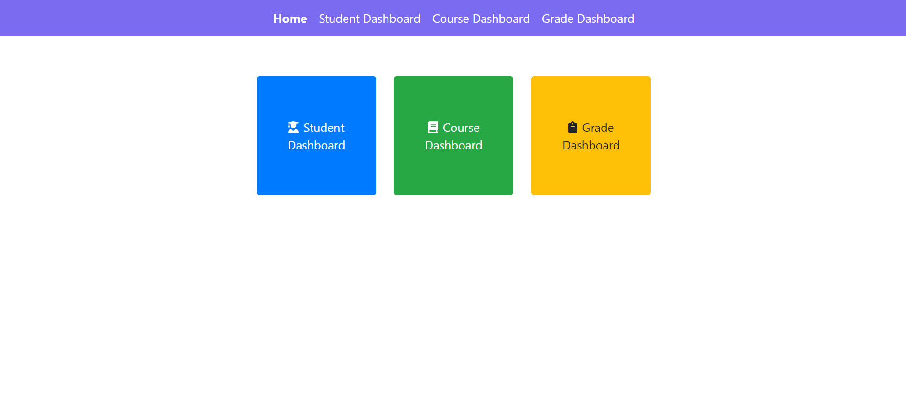
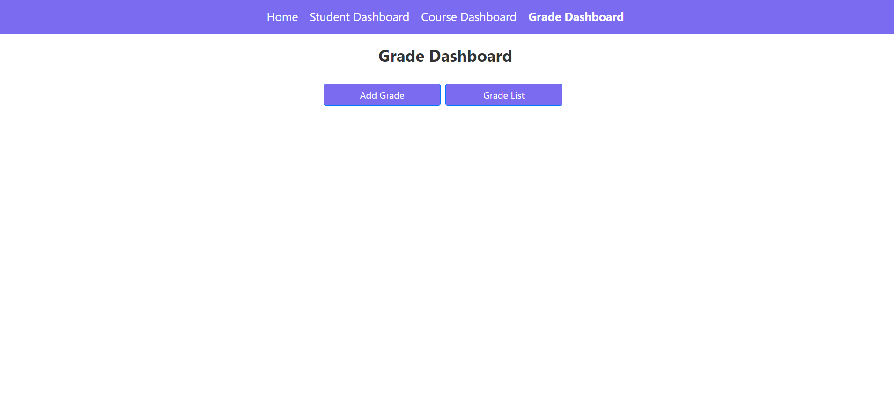
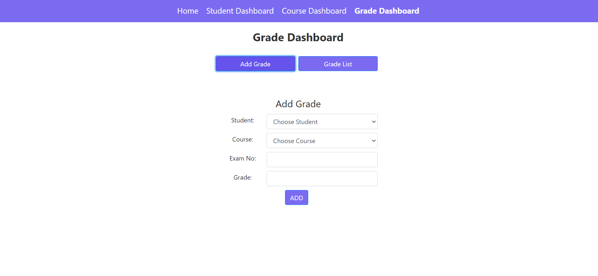
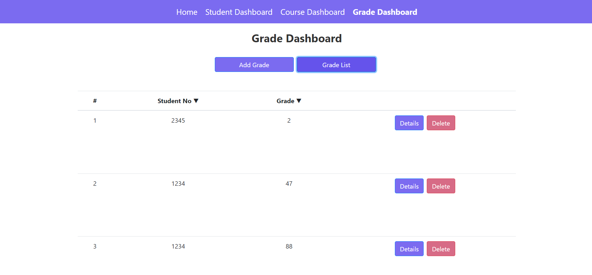

# Student Grade Tracking Application

This application provides a platform for teachers to record and view student grades. Teachers can create, view, edit, and delete grade records with student name, last name, and grade information.

## Project Description

This project aims to develop two separate applications using React.js and Spring Boot technologies. The React application provides the user interface and functionality to list, add, and view grades in detail. The Spring Boot application communicates with the React application to save and list grade records in the database.

## Features

## Installation

1. Run the Spring Boot application.
2. Run the React application.

## Usage

1. Open the application.
2. List grades, add new ones, or view details as needed.
3. Sort or delete grades as required.

